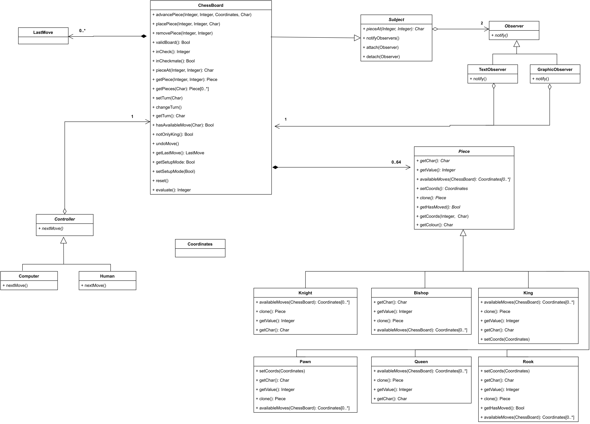

# cs246_chess

## Summary

CS246 - Object-Oriented Software Development Final Project - Fall 2022

Team Members: Jaryd Diamond, Lev Pollock, Oroni Hasan

This project was developed for CS246 A5, utilizing learned object-oriented design patterns. Received final grade of 110%

Follows all assignment specifications (plus bonus features):
- 4+ levels of difficulty for computer AI (uses negamax for all levels above 4, with increasing levels leading to increased difficulty)
- Ability to undo moves
- Setup mode for initially setting gameboard
- Graphical Display using X11
- Uses only smart pointers to ensure no memory leaks
- 3 modes of play:
  - Human vs Human
  - Human vs Computer
  - Computer vs Computer
  
## Gameplay

- *game white-player black-player* starts a new game
  - The parameters *white-player* and *black-player* can be either *human* or *computer [1-4]*
- *resign* concedes the game to your opponent
- To move: *move start_coords end_coords* (ex. *move e2 e4*)
  - Castling is specified by the two-square move for the king: *move e1 g1* or *move e1 c1* for white
  - Pawn promotion specifies the piece type to which the pawn is promoted: *move e7 e8 Q*
  - In the case of a computer player, the command *move* (without arguments) makes the computer player make a move.
- *undo* undos the last made move
- *setup* enters setup mode, within which you can set up your own initial board configurations. This can only be done when a game is not currently running
  - *+ K e1* places the piece K (i.e., white king in this case) on the square e1. If a piece is already on that square, it is replaced
  - *- e1* removes the piece from the square e1
  - *= colour* makes it colour’s turn to go next
  - *done* leaves setup mode
- When finished, ctrl-D will output final score

## Design

Created using the Model-View-Controller design pattern, along with the Observer pattern for outputting the terminal + graphic display.

Full UML Diagram:

